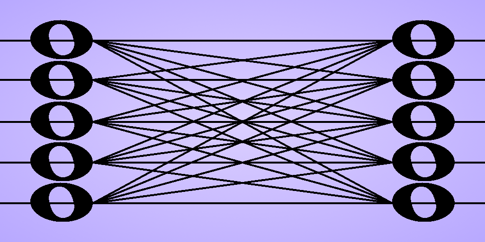

# BigNote GPT



__"I wish there was a _[Big Note Songbook](https://www.goodreads.com/book/show/13371596-roy-clark)_ version of a [GPT](https://en.wikipedia.org/wiki/Generative_pre-trained_transformer)."__

BigNote GPT implements a classic generative pre-trained transformer in beginner-friendly Python, attempting to demystify how data flows into, through, and out of the GPT architecture.

Text is tokenized with simple byte-level tokenization. Each part of the transformer is clearly identified and implemented with basic building blocks. Data transformations are annotated in comments.

BigNote GPT is designed to be trained on a small corpus. It's not a chatbot nor suitable for a large language model. Once trained on a corpus, a model takes text input and predicts what comes next. In other words, it generates text that mimics the style of its training data.


### Try it out

BigNote GPT is approachable from any level of technical expertise.

- Interact with two BigNote GPT [models](https://huggingface.co/spaces/jeff-lafitte/bignote-gpt) online.

- Train a model and interact with it by following the [quickstart](#quickstart) instructions.

- Experiment with training parameters defined in a model training [configuration](#training-configuration).

- Explore how a GPT is implemented in code using the GPT [architecture](#architecture) as a guide.


## Contents

- [Requirements](#requirements)
- [Quickstart](#quickstart)
- [Commands](#commands)
- [Training Configuration](#training-configuration)
- [Using TensorBoard](#using-tensorboard)
- [Architecture](#architecture)
- [Acknowledgements](#acknowledgements)
- [License](#license)

## Requirements
- [Python 3.11+](https://www.python.org/downloads/)
- [tomlkit](https://pypi.org/project/tomlkit/)
- [NumPy](https://numpy.org/)
- [PyTorch](https://pytorch.org/get-started/locally/)
- [TensorBoard](https://www.tensorflow.org/tensorboard) (optional)
- [CUDA-enabled GPU](https://developer.nvidia.com/cuda/gpus) with [CUDA](https://developer.nvidia.com/cuda-downloads) installed (optional)


## Quickstart

You will need [git](https://git-scm.com/install/) and [Python 3.11](https://www.python.org/downloads/) or later installed.

### Open a console.

### Move to the directory where you want to install BigNote GPT and clone this repository.

```
git clone https://github.com/jefflafitte/bignote-gpt.git
```

### Move to the `bignote_gpt` directory and create a virtual Python environment.

```
cd bignote-gpt
python3 -m venv .venv
```

### Activate the virtual Python environment.

#### On Linux

```
source .venv/bin/activate
```

#### On Windows

```
.venv\Scripts\activate
```

### Install [tomlkit](https://pypi.org/project/tomlkit/).

```
pip install tomlkit
```

### Install [NumPy](https://numpy.org/).

```
pip install numpy
```

### Install [PyTorch](https://pytorch.org/get-started/locally/).

PyTorch has different versions for running on CPUs and GPUs. The CPU version is _significantly_ slower for training. If you have a [CUDA-enabled GPU](https://developer.nvidia.com/cuda/gpus), installing the GPU (CUDA) version of PyTorch is highly recommended.

#### PyTorch for GPU (CUDA)

Use the [PyTorch web tool](https://pytorch.org/get-started/locally/) to generate the `pip install torch` command to use. (You don't have to install TorchVision.)

```
pip install torch --index-url URL
```

##### Additionally, on Windows

Windows users must also install triton for Windows.

```
pip install triton-windows
```

#### PyTorch for CPU

```
pip install torch
```

### Download a corpus to train on.

A couple of ideas:

[Tiny Shakespeare](https://raw.githubusercontent.com/karpathy/char-rnn/master/data/tinyshakespeare/input.txt) is 40,000 lines of text from Shakespeare's plays.

[Tiny Stories](https://huggingface.co/datasets/roneneldan/TinyStories/tree/main) are synthetically generated short stories.

First, create a `dev` directory inside the `bignote_gpt` directory. (The `dev` directory is ignored by the GitHub repository.)

```
mkdir dev
```

Place a corpus in the `dev` directory.

__Example:__ Use `curl` to download [Tiny Shakespeare](https://raw.githubusercontent.com/karpathy/char-rnn/master/data/tinyshakespeare/input.txt) into `dev/corpus.txt`.

__Linux/__
```
curl -L "https://raw.githubusercontent.com/karpathy/char-rnn/master/data/tinyshakespeare/input.txt" -o dev/corpus.txt
```

__Windows__
```
curl.exe -L "https://raw.githubusercontent.com/karpathy/char-rnn/master/data/tinyshakespeare/input.txt" -o dev/corpus.txt
```

### Create a training configuration file.

Use the `bignote_gpt config` command to create a training configuration.

#### Training on a GPU

If you installed the GPU (CUDA) version of PyTorch and want to train on a GPU, use the `--device cuda` option.

__Example:__ Create a training configuration file named `train.toml` to train the corpus from the previous example on a GPU.

```
python -m bignote_gpt config dev/train.toml --device cuda --corpus dev/corpus.txt
```

#### Training on a CPU

Be aware that training on a CPU takes a really long time.

__Example:__ Create a training configuration file named `train.toml` to train the corpus from the previous example on a CPU.

```
python -m bignote_gpt config dev/train.toml --corpus dev/corpus.txt
```

### Train a model.

__Example:__ Use the training configuration file from the previous example. A model will be saved in the default location `dev/model.pt`.

```
python -m bignote_gpt train dev/train.toml
```

### Interact with the model.

__Example:__ Interact with the model from the previous example.

```
python -m bignote_gpt interact dev/model.pt
```


## Commands

### config

```
python -m bignote_gpt config OUTPUT [--device DEVICE] [--compile] [--corpus CORPUS]
```

Create a training configuration file.

| Arguments       | Description                                     |
|:----------------|:------------------------------------------------|
| OUTPUT          | Path to the output training configuration file. |
| --device DEVICE | Device to train on: "cpu" or "cuda".            |
| --compile       | Compile the model if device is "cuda".          |
| --corpus CORPUS | Path to the corpus to train on.                 |

### describe

```
python -m bignote_gpt describe MODEL
```

Describe a trained model.

| Arguments | Description            |
|:----------|:-----------------------|
| MODEL     | Path to a saved model. |

### train

```
python -m bignote_gpt train CONFIG
```

Train a new model.

| Arguments | Description                              |
|:----------|:-----------------------------------------|
| CONFIG    | Path to the training configuration file. |

### generate

```
python -m bignote_gpt generate MODEL [--seed SEED]
                                     [--deterministic-cuda]
                                     [--prompt PROMPT]
                                     [--stop-at STOP_AT]
                                     [--stop-count STOP_COUNT]
                                     [--token-count TOKEN_COUNT]
                                     [--temp TEMP]
                                     [--top-k TOP_K]
                                     [--device DEVICE]
```

Generate text using a trained model.

| Arguments                 | Description                               |
|:--------------------------|:------------------------------------------|
| MODEL                     | Path to a saved model.                    |
| --seed SEED               | Random seed.                              |
| --deterministic-cuda      | Should GPU be deterministic.              |
| --prompt PROMPT           | Seed prompt.                              |
| --stop-at STOP_AT         | Output sequence to stop on.               |
| --stop-count STOP_COUNT   | Number of stop sequences before stopping. |
| --token-count TOKEN_COUNT | Maximum number of tokens to generate.     |
| --temp TEMP               | Sampling temperature.                     |
| --top-k TOP_K             | Restrict sampling to the top-k tokens.    |
| --device DEVICE           | Device to run on.                         |

### interact

```
python -m bignote_gpt interact MODEL [--seed SEED]
                                     [--deterministic-cuda]
                                     [--stop-at STOP_AT]
                                     [--stop-count STOP_COUNT]
                                     [--token-count TOKEN_COUNT]
                                     [--temp TEMP]
                                     [--top-k TOP_K]
                                     [--device DEVICE]
```

Interactively generate text from a trained model.

| Arguments                 | Description                               |
|:--------------------------|:------------------------------------------|
| MODEL                     | Path to a saved model.                    |
| --seed SEED               | Random seed.                              |
| --deterministic-cuda      | Should GPU be deterministic.              |
| --stop-at STOP_AT         | Output sequence to stop on.               |
| --stop-count STOP_COUNT   | Number of stop sequences before stopping. |
| --token-count TOKEN_COUNT | Maximum number of tokens to generate.     |
| --temp TEMP               | Sampling temperature.                     |
| --top-k TOP_K             | Restrict sampling to the top-k tokens.    |
| --device DEVICE           | Device to run on.                         |


## Training Configuration

The following settings can be adjusted in a training configuration file:

### System

| Setting             | Description                                         |
|:--------------------|:----------------------------------------------------|
| seed                | Random seed for reproducibility.                    |
| device              | Device to train on: "cpu" or "cuda".                |
| deterministic_cuda  | Force deterministic CUDA kernels if seed is set.    |
| cuda_compile        | Compile the model if device is "cuda".              |
| tensorboard         | Log training metrics to TensorBoard.                |
| tensorboard_log_dir | Directory for TensorBoard logs. (./runs if not set) |

### Corpus

| Setting | Description                       |
|:--------|:----------------------------------|
| path    | Path to the text training corpus. |

### Datasets

| Setting           | Description                            |
|:------------------|:---------------------------------------|
| training_weight   | Relative size of the training split.   |
| validation_weight | Relative size of the validation split. |
| testing_weight    | Relative size of the test split.       |

### Tokenizer

| Setting | Description       |
|:--------|:------------------|
| type    | Tokenizer to use. |

### Model

| Setting | Description     |
|:--------|:----------------|
| type    | Training model. |

### Model Config (Classic GPT)

| Setting           | Description                                                              |
|:------------------|:-------------------------------------------------------------------------|
| max_sequence_size | Maximum context length in tokens.                                        |
| embedding_size    | Embedding size.                                                          |
| block_count       | Number of transformer blocks.                                            |
| head_count        | Number of attention heads (must be an integer factor of embedding_size). |
| dropout           | Dropout probability.                                                     |

### Optimizer

| Setting | Description       |
|:--------|:------------------|
| type    | Optimizer to use. |

### Optimizer Config (AdamW)

| Setting      | Description                                 |
|:-------------|:--------------------------------------------|
| weight_decay | Weight decay (applied to 2-D weights only). |
| betas        | AdamW beta coefficients.                    |
| eps          | AdamW epsilon for numerical stability.      |

### Trainer

| Setting             | Description                                            |
|:--------------------|:-------------------------------------------------------|
| max_iteration_count | Total number of training iterations.                   |
| warmup_count        | Iterations to linearly warm up the learning rate.      |
| learning_rate       | Peak learning rate (after warmup).                     |
| min_learning_rate   | Final learning rate at the end of cosine decay.        |
| evaluation_period   | Evaluate every N iterations.                           |
| evaluation_count    | Batches per evaluation.                                |
| patience            | Stop after N evals without improvement (0 = disabled). |
| batch_size          | Training batch size.                                   |
| gradient_clip       | Max gradient norm for clipping.                        |

### Output

| Setting | Description         |
|:--------|:--------------------|
| path    | Trained model file. |


## Using TensorBoard

TensorBoard visualizes changes in learning rate and loss values from a model training. You can view changes in real-time or after training.

### Installation

#### Move to the bignote_gpt directory and install TensorBoard.

```
pip install tensorboard
```

### Enabling TensorBoard metrics

Enable TensorBoard in a training configuration file.

```
[system]

# Log training metrics to TensorBoard.
tensorboard = true
```

### Generating TensorBoard metrics

Train a model using the training configuration file with TensorBoard enabled. Here, it's `train.toml`.

### Running TensorBoard

TensorBoard will provide a local URL that you open in a browser.

```
tensorboard --logdir=runs
```

## Architecture

Refer to the table and diagram below to find where GPT architectural components are implemented.

| Component         | Python source                                                                                              |
|-------------------|------------------------------------------------------------------------------------------------------------|
| Generator         | [bignote_gpt/generator.py](bignote_gpt/generator.py)                                                       |
| Transformer       | [bignote_gpt/models/classic/transformer.py](bignote_gpt/models/classic/transformer.py)                     |
| Transformer Block | [bignote_gpt/models/classic/transformer_block.py](bignote_gpt/models/classic/transformer_block.py)         |
| Attention         | [bignote_gpt/models/classic/masked_self_attention.py](bignote_gpt/models/classic/masked_self_attention.py) |
| Feed Forward      | [bignote_gpt/models/classic/feed_forward.py](bignote_gpt/models/classic/feed_forward.py)                   |


## Acknowledgements

[Neural Networks](https://youtube.com/playlist?list=PLZHQObOWTQDNU6R1_67000Dx_ZCJB-3pi) from [3Blue1Brown](https://www.youtube.com/@3blue1brown) is a great introduction to the basics.

[Neural Networks: Zero to Hero](https://youtube.com/playlist?list=PLAqhIrjkxbuWI23v9cThsA9GvCAUhRvKZ) from [Andrej Karpathy](https://karpathy.ai/) is an unmatched deep-dive into programming AIs from scratch. The [makemore](https://github.com/karpathy/makemore), [nanoGPT](https://github.com/karpathy/nanoGPT) and [nanochat](https://github.com/karpathy/nanochat) implementations are essential references.


## License

[MIT](LICENSE)
